# IRIS dataset 
***

## Purpose: 

This project aims to highlight some of the possibilities in Python for data visualisation using the Iris dataset. This README.md file will also dive into some of the observations from the information generated using the analysis.py program.  

## Summary of IRIS dataset:
***

The IRIS dataset, created in 1936, is a popular dataset commonly used for exploring data analysis and data visualisation.

The dataset consists of measurements for 3 different species (setosa, versicolor and virginica) of Iris flowers.  
There are 50 entries per species detailed in the dataset.

### Species:
|Setosa    |Versicolor | Virginica|
|-----------|---------------|------------|
||||

As the species variable are plain text, the data type string will be applicable here.

Four characteristics of the flowers were tracked including sepal length, sepal width, petal length and petal width.  
These four variables are numeric values and looking at the raw data we can see decimal places are present. 
With this, the data type used for this variables will be float.

## Cloning repository from GitHub:
***

1. Copy the following URL:  
        https://github.com/Ange-Dvs/pands-project.git

1. Open CMDER or if using VS Code open the terminal pane

1. Go to the folder where you want to clone the repository to on your machine and type git pull.  
        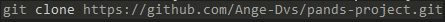

1. Set merge as the mode for the pull  
        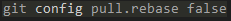

1. Initiate the pull of the GitHub repository  
        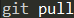

1. If the pull has been successful you should see 4 files pulled from GitHub
        The .gitignore file, a csv file containing the dataset, the readme.md (and a folder containing images used in the readme.md) and the analysis.py file which contains the program to run.  
        

## How to run *analysis.py*:
***

1. To run the code open CMDER or the terminal in VS Code.
1. Navigate to the folder where the repository is stored.
1. Type 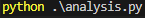 and hit enter. 
1. The python code should run and generate 8 files.
    - modified_iris_data.csv created
    - hist_sepal_length.png created.
    - hist_sepal_width.png created.
    - hist_petal_length.png created.
    - hist_petal_width.png created. 
    - scatter_all_variables.png created. 
    - hist_all_variables_per_species.png created. 
1. If the code has run successfully you will see confirmation printed when each file is created.  
        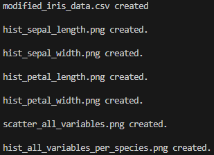

### Error handling within *analysis.py*:

Error handling is including in the code to ensure if a file is already existing in the folder with the same filename the user will be informed.

The error messages will look like this:  

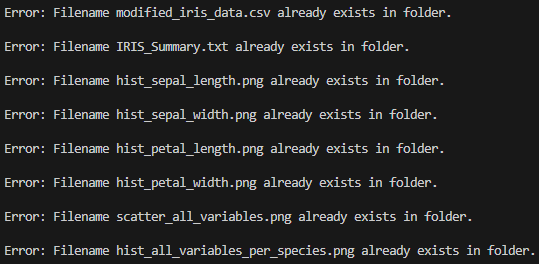

If the error message for a file is returned that file will not be re-created or overwritten.
If you want to rerun the code and create the files again, you'll need to delete the existing file or files first.    

## Walkthrough of *analysis.py* code:
***
The next section of the notebook is a walkthrough of the contents of the analysis.py file.  
While the functionality will be explained in this notebook, a line by line explanation of the code is contained within the analysis.py file itself.

The code contains the creation of:
- A modified CSV file with shortened names for variables
- A summary text file including some calculations using the data within the dataset
- Multiple png files containing histograms of the variables showing the distribution of the dataset overall and colour coded per species and a larger figure containing a subplot showing the variables per species separately
- A png file show a scatter plot of each pair of variables

To have a concise view of code for the generation of the different files the order you will see the code here differs slightly to that in analysis.py. 

### Importing required libraries

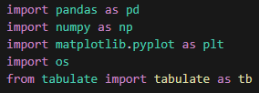

> ℹ️ *For more details on the libraries and information of the functions used within each libraries check the "[Libraries within python](#libraries-witin-python)" section*

### Reading in the data

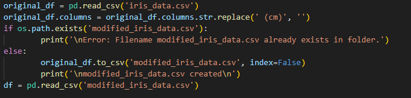

### Error handling for PNG files

One function reused throughout the code is the check_png_file_exists() function.  
This enables a error message to be returned to the user if the a filename for one of the generated plots is already existing

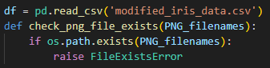

The above function reads in the value passed for the PNG_filename variable allowing the functionality to be reused throughout the program for the creation of the multiple PNG files.  

The OS library is used to check if the path exists for the file and raises a FileExistsError in case the filename is present in the folder, which in turn triggers the except path of the code outside of the function.  

### Creating the summary file

First we'll take a look at the function created for the creation of the summary file write_summary_file().

.png)

<b>Definition of variables and main text created for the text file</b> 

In the above, the FILENAME is first defined to be used for the error handling in case the file is already existing when the program attempts to create it.  

Then the function attempts to follow the try path, here the file is created. Setting 'x' as the mode ensures that a FileExistsError is thrown is the file exists and will not amend or overwrite the file if it is already in the folder. If this happens the program will jump to the except path and print a message for the user informing the file already exists.  

Within the step of creating the file the encoding is also set, UTF-8 is used to allow for symbols used in the table generated for the summary file to be saved to the text file.  

The following lines include the definition of numerous variables to use in the intro file. This intro which includes the main bulk of text and a mathematical summary of the variables is then written to the text file. Next the program moves to code calculating the correlation coefficient and displaying it for the user in an easy to read view as a table.  

<b>Calculation of the correlation coefficient</b> 

An empty dictionary is created to later store the calculated correlation of the pairs of variables. A dictionary called "dfs_to_use" and a list called "xy_values" are passed from outside the function for use in the calculation. These are used to create a loop to allow the correlation for the relevant pairs of variables to be generated dynamically using values passed from the list and dictionary, removing the need for repeated lines of code with the variables hardcoded.  

The parent for loop passes over the different classes contained in the dfs_to_use, this allows the calculation of the correlation overall using the dates in the entire dataset for all classes and then calculate it for the individual classes. Within the classes for loop another for loop is used to iterate through the xy_value list. enumerate is then used to take the values from the tuples contained in the list and parse them to the variables x_value and y_value, it also starts the value the counter of the loop (i) to 1. 

Next an if statement is set so that the calculation is only carried out for certain iterations of the loop. This is to avoid carrying out the same calculations more than necessary as the list is used also for the generation of the scatter chart and contains blank "empty" tuples and the same variables twice with the order swapped (i.e. ('sepal width', 'sepal length') and ('sepal length', 'sepal width')).  

When the if statement condition is met, it is executed and the correlation is calculated using the class defined in the parent "for" loop and the x and y value defined in the second for loop. The name is then created using these values to allow for us to index into the dictionary when creating the table. The name and calculated correlation are then saved as a keypair to the correlations dictionary.

<b>Creation of the correlation coefficient table</b> 

After all calculations are completed a list is created called "table" which contains 5 sub-lists, you can think of each list as representing a row in a table.   

The first row will be used to set the headers for the table using the string values it contains. The second list contains the values for the calculated coefficient for the entire dataset. The third list calls the data for relevant correlation values for the Setosa only, followed by the Versicolour list fourth and lastly the values for the Virginica class in the fifth list. The name of the keypair is used to index into the "correlations" dictionary and retrieve the value for the corresponding correlation.  

The tabulate library is then used to take the "table" list and format it as a table, it is set to consider the first row to be headers and the fancy grid option for the formatting is used to make it more pleasant to read the table. The table is then written to the summary file and the code for writing the summary file within the function is finished.

**Main Program Code Snippet**

.png)

To make the program easily readable for the user the main code block outside of the function is minimum, for the creation of the summary file the relevant components in the main code block can be seen above. 
1. The xy_value list - used to set the variables which should be used for calculating the correlation coefficient
1. The dfs_to_use dictionary - used for selecting which data to use in the correlation calculations using first the data for the entire dataset and then separating the entries depending on class.
1. Line triggering the write summary file - this calls the function to be initiated and passes the list and dictionary to the function to be used within the function itself. 

### Creating Histograms
***

The creation .png files showing the distribution of each variable via a histograms is the next functionality we'll go through.

.png)

The function uses the keypair values from the variable_and_filenames dictionary.  

A for loop is used to iterate over the keypairs in the dictionary reducing unnecessary repetition of lines of code. The try path is first attempted, if the check_png_file_exists() function (explained earlier in the notebook) returns a FileExistsError the except path will be triggered. The size of the figure for the png file is set to allow for the image to be large enough to comfortably fit the data in the image in an easily readable way.

Next the creation of two plots is triggered, first a plot showing the data for the variable in a given loop within the entire dataset, this is then plotted to the subplot in the first position. 

Next the histogram is created again for the subplot in the second position however this time the data is separated and colour coded per class of Iris to visualise the spread of distribution depending on the class for the variable. This is done using the "stacked" attribute to allow the data to be stacked on top of each other instead of treated as seperate columns. 

<b>Customizing the histograms</b> 

Along with the figure size being set, there are various settings defined for customizing the appearance of the histogram.
The colour to be used for plotting the data per class is defined, the yticks are removed from the second subplot to avoid overcrowding of the figure as subplot 2 using the same range as the first subplot.  An overall title detailing the variable which is being plotted is added and the font side and position set. A shared label for the x axis is created using figtext since the plots share the same variable, the style, size and position of the text is defined. 

Lastly the file is saved using the filename passed in from the dictionary and ensuring no data like the title is cut off using the bbox_inches attribute. A message is then printed to the user to inform them that the file has been created and providing the filename.

**Main Program Code Snippet**

.png)

To make the program easily readable for the user the main code block outside of the function is minimum, for the creation of the histogram file the relevant components in the main code block can be seen above. 
1. The variables_and_filenames dictionary - used for passing the variable to plot in a loop to the function and the related filename to use when saving the figures.
1. Line triggering the create_histograms() function - this calls the function to be initiated and passes the dictionary to the function to be used within the function itself. 

### Creating the scatter plot
***

.png)

The function uses the tuples from the xy_value list to generate a figure containing 16 subplots.

The try path is first attempted, using check_png_file_exists() function (explained earlier in the notebook) again, if it returns a FileExistsError the except path will be triggered. The filename and size of the figure for the png file is set to allow for the image to be large enough to comfortably fit the data in the image in an easily readable way to avoid potential overlap and ensure the plots are readable and not too small considering a large number of subplots are required to fit in the final figure.  

<b>Looping over the values to be used for x and y</b> 

A for loop is also used in this function to iterate over the tuples in the list to reduce excess lines of code, setting the corresponding information in the tuple as the x and y value to be used in the plots, a counter is created as "i" with a starting value of 1 to allow the counter to be used to dynamically set the position of the subplot for each iteration later. 

<b>Creating empty plots & condition for saving the figure</b> 

An if statement checks if the iteration is matching one of the numbers in the condition, if it does the corresponding plots will not contain a scatter plot but instead an empty plot is generated. The figtext method is used to position the name of a variable within the boundaries of the empty plot, this is to reflect which variable is being used for the x axis in a column and the y axis in the row where that plot is located.  

It also contains the logic to identify if the loop is in the last iteration to ensure the file is saved and the relevant steps which are only required to be completed once at the end are triggered. This includes the creation and positioning of the legend, the creation of the title for the figure and ensuring the layout is not overlapping. A message is also printed for the user at this stage in the loop to confirm the creation of the scatter plot .png file. 

<b>Creating subplots containing the scatter plot of each pair of variables</b> 

The main else block contains the path all other iterations should take which involves actually creating scatterplots using the values contained in the tuples in the xy_value list. This block also includes a check for which class is being plotted and setting the corresponding colour depending on the class. 

An if statement is also used to ensure that the data for the dataset as a whole is not plotted as the goal is to show the scatter plot with colours indicating which class is linked to each marker on the plot. If any of the individual classes are used for the iteration is it trigger the line of code responsible the creation of the scatter plot, the line is dynamic using the value for the class_df from the dfs_to_use diction and the x and y values are select using the tuples in the xy_value list for each iteration. 

<b>Customization of x and y ticks for specific subplots</b>  

As the requirements for customization of the plots varies depending on which position the subplot is located, a series of if elif statements are used to enhance the settings for the subplots depending on the iteration/subplot using the value of "i". The majority of the subplots require the removal of the x and y ticks, this is handled by the first if statement. 

The next 5 elif statements contain the ability to remove the x or y ticks or move the x or y ticks depending on what is required for the plot. For example for the subplot in position 4, the x and y ticks are set to be placed on the opposite side of the plot. Instead of the x labels and ticks being on the bottom of the plot as per the default, they are set to be moved to the top of the plot. Similarly for the y axis the y labels and ticks are set to be placed on the right of the plot instead of the left. This is done to reflect that the same range is used for all of the values in that column and y values in the row, in the end aiming to reduce clutter in the image and make the plot easier to read for the user. 

**Main Program Code Snippet**

.png)

To make the program easily readable for the user the main code block outside of the function is minimum, for the creation of the scatter plot file the relevant components in the main code block can be seen above. 
1. The xy_value list - used to set the variables for the x and y axis of each subplot depending on the iteration of the parent for loop within the function
1. The dfs_to_use dictionary - used for selecting which data to use in creation of the scatter plots, these values are also used for selecting the colour to be used in the loop for each class.
1. Line triggering the create_scatter_all_variables() - this calls the function to be initiated and passes the list and dictionary to the function to be used within the function itself.

### Creating figure containing histograms of each variable isolated per species

.png)
.png)

Likewise with the other plots, a check is done to ensure the file is not already existing and informing the user if this is the case.  
If the file is not existing already, the program continues the try path.  

The size for the overall figure is first set outside of the loop as we want all subplots within the same png file.  
A counter s is defined, this will be used to dynamically set the value for the subplot position in the figure.  

Next a for loop is defined with the purpose of cycling through the variables in the variable and filename dictionary. 

#### Setting the bin width 
In order to have the width of the bins in the histograms consistent for each of the classes individual histogram per variable, a function gets the minimum value in the dataset for a variable and sets that as the min width.  
The same approach is carried out to find the max value, these two numbers are then used to generate an array of evenly spaced numbers using NumPy's linespace function.  
This is then used to set the bin width for all histograms for that variable, when the loop changes to the next variable, the min and max value will be recalculated to get the appropriate range again for the columns width for the next iteration of the function.

#### Customization of the histograms
After the set_bins_width() function is completed it returns that values to be used in the parent function.

The next steps involves a for loop taking the values from the dfs_to_use list and sets them to the variables class_name and class_df.  
The class_df is then used to determine which class of data is represented in the plot.  
The first item in the dfs_to_use list contains the entire unfiltered dataset, which we do not want to plot.   
With this and if statement checks to ensure the plotting is only carried out for the other items in the list. 

Depending on which subplot is being generated we set the colour to be used for the bins, either remove the y ticks or move them to the right hand side of the plot positioned in the last row of each column. A label is also added in these loops to show which variable is being plotted in the rows.  
The title field is used to create a line break in between the rows to visualise the separation of the variables.

#### Setting y axis range
Next they y axis limits are set for the row of plots, a function sets the limits for the y range depending on the variable. i.e. all subplot in row 1 have the same y range defined so you can see the height of the columns and compare to the other subplots for the same variable.

In this function the min for y axis is set to 0 for all plots in the figure. An if statement branches out to decide what the max should be for the axis depending on the subplot being created using the value for the iteration counter. 

The y axis range is then set for the respective variable.  

#### Plotting the histograms
After the y range is set to histogram has all needed information for the subplot to be created.  
The data to be used is pulled from the class_df for the iteration, the variable to plot is passed in from the first for loop, the bins are set using the returned value from the set_bins_width() function and the colour is chosen depending on the subplot in question. 

At the end of the if statement the value for s is updated to allow it to be used as the value for the next subplot.  
This loop continues until the 12 subplot is generated, at this point the required steps which should only be done once or at the very last step are completed.  
The title is added using the font size chosen and the position set for the y axis. 
The legend is generated and font size chosen. Using the "loc"  and "bbox_to_anchor" attributes the position for the legend in this figure is set, being displayed at the very top of the figure just under the title since it is relevant for all plots in the figure. The legend is also customized to have 3 columns, with one class key shown in each column.

The file is then saved and the user is informed the file has been created using the value set as the PNG_filename at the beginning of the function.

**Main Program Code Snippet**

.png)

To make the program easily readable for the user the main code block outside of the function is minimum, for the creation of the scatter plot file the relevant components in the main code block can be seen above. 
1. The dfs_to_use dictionary - used for selecting which data to use in creation of the scatter plots, these values are also used for selecting the colour to be used in the loop for each class.
1. The variables_and_filenames dictionary - used for passing the variable to plot in a loop to the function when creating the subplots.
1. Line triggering the create_scatter_all_variables() - this calls the function to be initiated and passes the list and dictionary to the function to be used within the function itself.

### Creating figure containing histograms of each variable for entire dataset

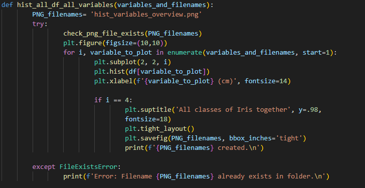

Likewise with the other plots, a check is done to ensure the file is not already existing and informing the user if this is the case.  
If the file is not existing already, the program continues the try path.  

The size of the final figure is then set. A for loop is initiated with a counter "i" starting at 1. This counter is important as it will be used to dynamically set the subplot location depending on the iteration. The variable to plot is taken from the variable_and_filenames dictionary. This dictionary is also used as the bases for the for loop ensuring that each variable will be plotted. 
To the a-axis of each suplot a label is added so that it is possible to identify which variable is being shown in a specific plot since each plot shows a different variable. 

On the fourth iteration the loop completes extra one time steps like adding a title to the plot, also setting the location and font size for the title. Matplotlib.pyplot's tight_layout is used to adjust the space between the plots as needed. The file is then saved and a message returned to the user informing the file has been created and specifying the filename.

**Main Program Code Snippet**

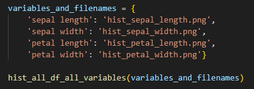

## Analysis of findings from analysis.py
***

Ideas for what to include for analysis :

- Break down per  variables per class of Iris? maybe too much information and not needed
- Calculated correlation of: each pair of variables in the dataset maybe add then into scatter chart somehow?
- discussion on standard deviation for the histograms. 

### Correlation between variables 

<b>Overall dataset:</b> 
When looking at the calculated correlation between the variables using the entire dataset we can see that some pairs of variables appear to be strongly linked. 

**Variables showing strong positive correlation**
- Petal Length vs Sepal Length: 0.871754    
- Petal Width vs Sepal Length: 0.817954   
- Petal Width vs Petal Length: 0.962757  

The results of the correlation coefficient for the 3 pairs of variables listed above indicate a strong positive, when one variable in a pair increases the other is likely to increase as well.  
The Petal Width vs Petal Length pairing appears to be a near perfect linear positive correlation of 0.962757.

**Variables showing a moderate negative correlation**
- Petal Length vs Sepal Width: -0.420516   

For the pair above there is a moderate negative correlation, the correlation is not as strong as the previously discussed pairings.  
We also see that the direction of the relation is negative, negative relations in theory would indicate that when one variable increases the other is actually likely to decrease.  
While the correlation is still a significant enough amount to indicate some relationship between the pairings it is not as reliable. 

**Variable showing a weak or very weak negative correlation**
- Petal Width vs Sepal Width: -0.356544  
- Sepal Width vs Sepal Length: -0.0109369  

When looking at the sepal width vs sepal length we can see this is the weakest of the correlations when look at the dataset as a whole.  
The result is indicating an extremely week negative relationship between the two and it could not be assumed that as variable increases the would decrease in a proportionate way.  

Next we'll factor in the class of Iris to see if the correlation between the variables differs depending on the class.

<b>Breakdown per species:</b> 

##### *Setosa*

**Variables showing strong positive correlation**
- Sepal Width vs Sepal Length: 0.74678 

**Variable showing a weak or very weak negative correlation**
- Petal Width vs Petal Length: 0.306308
- Petal Width vs Sepal Width: 0.279973
- Petal Width vs Sepal Length: 0.279092
- Petal Length vs Sepal Length: 0.263874
- Petal Length vs Sepal Width: 0.176695

##### *Versicolor*

**Variables showing strong positive correlation**
- Petal Width vs Petal Length: 0.786668  
- Petal Length vs Sepal Length: 0.754049  

**Variables showing a moderate positive correlation**
- Petal Width vs Sepal Width: 0.663999
- Petal Length vs Sepal Width: 0.560522
- Petal Width vs Sepal Length: 0.546461
- Sepal Width vs Sepal Length: 0.525911

##### *Virginica*

**Variables showing strong positive correlation**
- Petal Length vs Sepal Length: 0.864225  

**Variables showing a moderate positive correlation**
- Petal Width vs Sepal Width: 0.537728  
- Sepal Width vs Sepal Length: 0.457228
- Petal Length vs Sepal Width: 0.401045  

**Variable showing a weak or very weak positive correlation**
- Petal Width vs Petal Length: 0.322108  
- Petal Width vs Sepal Length: 0.281108  

**Observations from correlation table**

Interesting to observe the different in correlation between the classes of Iris for a pair of variables and that when the 3rd factor of the class is added you see very different results in the correlation between the variables. 

For example when we look at the Petal Width vs Petal Length overall we see a near perfect positive correlation of 0.962757.  
However, when we look across the class we see Setosa (0.306308) and Virginica (0.322108) have a much weaker correlation compared to when looking at the values for all species as one.  

Likewise with with Petal Length vs Sepal Width overall we see that there is a moderate negative correlation across the dataset (-0.420516). 
In contrast when we look at the individual classes, none of the classes suggest a negative relationship between the petal length vs sepal width when the data for a class is separated. In fact when looking at Virginica and Versicolor as individual groups of data we can see that they have a moderate positive correlation between the variables. 

Another example which highlights the difference once taking the class into consideration is the Sepal Width and Sepal Length. Looking at the calculation for the overall dataset you would assume that there is very weak negative correlation between the pair of variables throughout the dataset. However, when we look at the individual classes we see that actually all relationships indicate a moderate - strong positive relationship between the variables.

We can also see that each class of Iris has its pattern and relationship between the classes, indicating that the class of species has a big effect on the petal and sepal sizes. 

This highlights the importance of understanding the complexity of the data in the dataset and the importance of considering underlying factors when interpreting the results.  
If we were to base our understand of the correlation of the variables bases solely on the calculated correlation of the overall dataset combined it would be very easy to reach some incorrect conclusions.

#### Scatter plot analysis: 

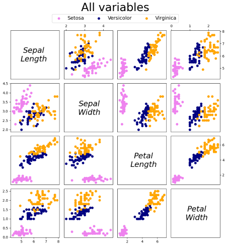

Looking at the scatter plot above we can make some interesting observation. 

Setosa appears to be more of an outlier and the easiest of the classes to distinguish using the characteristics of the sepal and petal, with Versicolor and Virginica being more closely grouped across all plots.

If trying to use the data to distinguish between the different classes the Sepal length vs Sepal width would be the most overlap of the Versicolor and Virginica markers on the plot. The wide spread for the variables also shows us that there is a lot of variety in the ranges in this pairing.  

In contrast the Petal length vs petal width may be a better candidate to use as we see the class markers overlapping less and the data more tightly clustered together on the x and y axis.

From the plots we can also see that of the classes, the Virginica class tends to have the widest and longest petals, with Setosa being much smaller in these respects.  

#### Histogram analysis

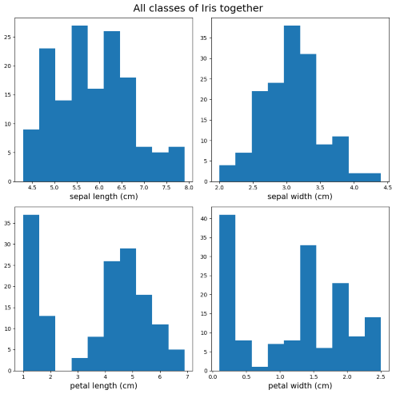

Looking at the variables plotted for the dataset the data seems quite spread out.  

For petal width and sepal length the histogram appears to be multimodal with more than 1/2 peaks.  
For petal length the histogram appears to be bimodal with two distinct peaks.  
Then for sepal width this histogram appears to be unimodal.  

Next we'll take a look at the histograms when the class of Iris is considered to see if this provides any further insight for the distribution of the variables.

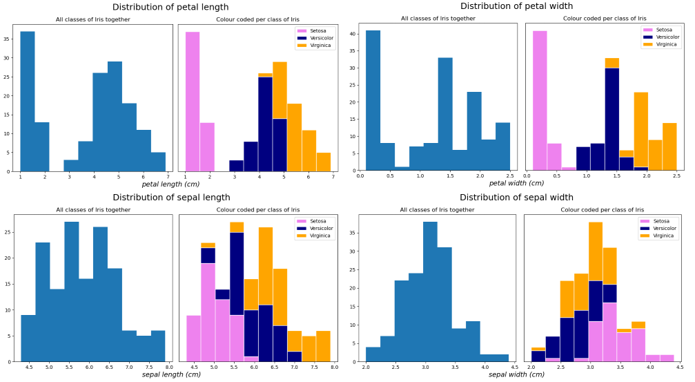

From the above we can see that the classes overlap for some variables more that other. With some variables sharing a lot of similarities in size and other having less overlap. 

Next we'll take a look further into the different variables separately.

##### Petal length

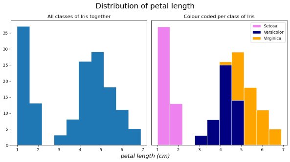  

When looking at the Petal length for the entire dataset as one we can see moderate variety in the data, with one peak completely separated from the remaining cluster. 

From the summary file we identied that the standard deviation for the petal length is 1.76cm. Knowing the range is 1cm (min) to 6.9cm (max) we can interpret that that there is a moderate spread from the mean. From the text file we can also see that the mean is 3.76cm and looking at the plot above we see that this is one of the smaller bins in the histogram and we can also see the distribution is not uniform and there is a clear gap between two cluster groups in the histogram.

Adding in the class a new perspective is shown across the dataset.  
For the Setosa we can see these flowers are very separated from the rest with a strong grouping between 1 - 1.5 (cm). 

For the Versicolor and Virginica we seem an overlap with these two classes having more similarities when it comes to their petal length.

This shows us that the Setosa class are more easily distinguished from the remaining classes when it comes to petal length. We also see that the Virginica class are likely to be the longest of the petals while the Versicolor will fall somewhere in between.

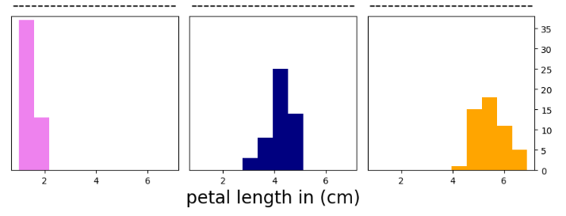

Looking at the data isolated per graph we can see the distribution for the Versicolor and Virginica more clearly.  
For Versicolor we can see the histogram is a unimodal struction, while not as severe as the Setosa, there is one peak. While Virginica we do not have as drastic of a difference between the bins. 

##### Petal width

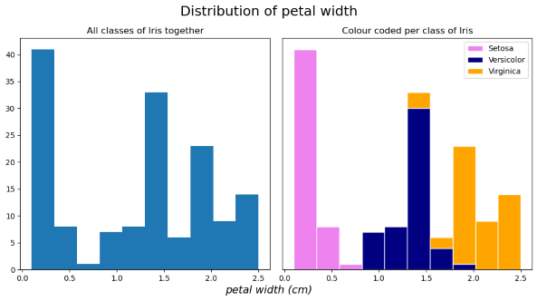

Looking at the dataset as a whole together we see the histogram is multimodal with multiple peaks in the plot suggesting that there is a lot of variablity in petal widths across the Irises as a whole.

Interestingly when we add the 3rd factor of class into the plot we can see that the three peaks show the main clusters for the individual classes. 

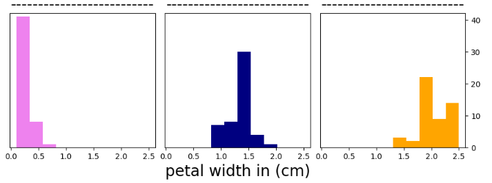

Similarily to the petal length, we see that the Setosa data is clustered to the smaller end of the x-axis between (0.1cm to 0.6cm), with this clear seperation the petal width or length could be a good candidate if trying to use the data to identify if an Iris is a Setosa.

With the Versicolor and Virginica classes we see the again slight overlap in the ranges but lets look at the classes seperatly to get a clear picture. 

We can see that that the histogram for the Versicolor class is unimodal with a clear peak in the distribution and again seems to lie in the middle Setosa and Virginica in terms of size.  
The Virginica class appears to have again a less distinct peak and has more of a spread with the largest standard deviation of the group (0.27cm) and the largest petals in both length and width.

##### Sepal length

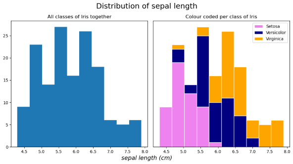

Moving next to the Sepal length again we see a multimodal histogram with the majority of the data clustered to the centre and left of the plot.  

In contrast to the Petal length and width histograms we can seen in the sepal length there is much more of an overlap between the 3 species.  

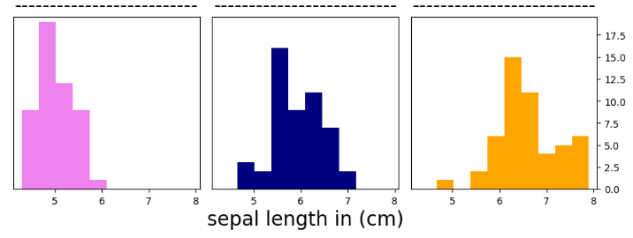

When looking at the classes isolated with their own plots we can see that again the Setosa class is towards the smaller end of the plot with a single peak. When taking the petal width and length into consideration we can see that the Setosa data tends to be clustered closely and to the left of the plot. 

The range for Versicolor, like for the petal width and length, appears to be in the middle of the Setosa and Virginica clusters. Virginica again seeming to contriubute mostly to the right end of the plot with larger sepal length. 

##### Sepal Width 

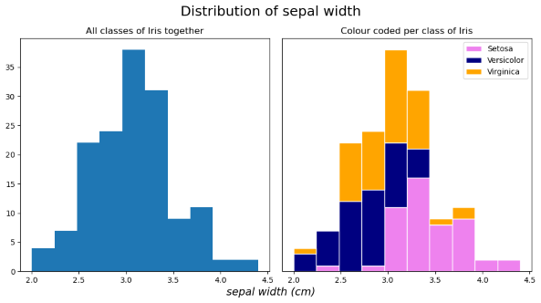  

When coming to the Sepal width we see that this histogram tends to seem to be the most fitting of the normal dsitribution label with one main peak around the mean (3.05cm).

Like with the sepal width there is much more overlap between the classes versus the histograms of the petal length and width. 

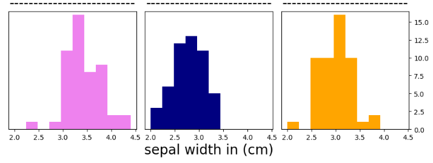

In contrast to the other variables we see for the cluster for the Setosa class is located primarily on the right of the plot, making up the majority of the entries for the larger values recorded. 

Versicolor in comparision is making up the left tail of the distribution with a shape most comparible to normal distribution comparing to the other two classes.  
Like the Setosa class the Virginica data also is unimodal with one peak. 

From looking at the sepal variables (width and length) we see for both that the ranges for the sepal characteristics tend to overlap more than that of the petal characteristics. 

### Additional resources/reading:
***
Adding screenshots to Jupyter notebook
https://medium.com/@yogeshkd/four-ways-to-embed-images-in-your-jupyter-notebook-powered-blog-2d28f6d1b6e6#:~:text=1.,command%20to%20embed%20the%20screenshot.

https://en.wikipedia.org/wiki/Iris_flower_data_set  
https://www.markdownguide.org/hacks/  
https://www.kaggle.com/datasets/uciml/iris  
https://archive.ics.uci.edu/dataset/53/iris  
https://matplotlib.org/2.0.2/api/markers_api.html  
https://matplotlib.org/stable/api/_as_gen/matplotlib.pyplot.legend.html  
https://matplotlib.org/stable/gallery/subplots_axes_and_figures/subplots_demo.html  
https://matplotlib.org/stable/gallery/statistics/histogram_multihist.html  
https://www.geeksforgeeks.org/create-a-stacked-bar-plot-in-matplotlib/  
https://www.pythoncharts.com/matplotlib/histograms/#:~:text=The%20histogram%20bars%20have%20no,some%20separation%20between%20the%20bar.&text=An%20alternative%20is%20just%20to%20make%20the%20bars%20skinnier%20using%20rwidth%20.  
https://matplotlib.org/stable/users/explain/colors/colors.html  
https://levelup.gitconnected.com/unveiling-the-mysteries-of-the-iris-dataset-a-comprehensive-analysis-and-machine-learning-f5c4f9dbcd6d  
https://matplotlib.org/3.1.1/api/_as_gen/matplotlib.pyplot.clf.html#matplotlib-pyplot-clf   
https://matplotlib.org/3.1.1/api/_as_gen/matplotlib.pyplot.suptitle.html  
https://www.geeksforgeeks.org/matplotlib-pyplot-suptitle-function-in-python/  

https://www.simplilearn.com/tutorials/python-tutorial/enumerate-in-python
https://www.freecodecamp.org/news/how-to-check-if-a-file-exists-in-python/  
https://www.geeksforgeeks.org/python-check-if-a-file-or-directory-exists/

https://www.w3schools.com/python/ref_dictionary_items.asp
https://www.geeksforgeeks.org/python-dictionary-items-method/
https://docs.python.org/3/library/stdtypes.html#dictionary-view-objects

Inspiration for format of the scatter plot https://en.wikipedia.org/wiki/Iris_flower_data_set#/media/File:Iris_dataset_scatterplot.svg

OS - https://docs.python.org/3/library/os.html
     
## Libraries within python
***

Within the program we are importing various external libraries and classes to use throughout the notebook including: 
- Pandas
- Matplotlib.pyplot
- NumPy
- Tabulate
- OS

#### Pandas:
Pandas[^] is a library in Python used for data analysis which enables the use of two-dimensional tables called DataFrames.  
Within the *analysis.py* file the Pandas library is used to read in the data from the Iris dataset.  
The following are some methods used throughout the project from Pandas: 
> .corr - used for calculating the correlation coefficient of the variables flipper length and body mass in the dataset.[^]

> .unstack - used with the groups created with groupby() to arrange them in an organised manner. This allows us to create a stacked bar chart to visualise the data of the species per island.[^] 

> .std - used to calculate the standard deviation in the dataset to determine the spread of the values for a variable from the mean. [^]

#### Matplotlib.pyplot:
The Matplotlib.pyplot library is used mainly for visual representation of the dataset.
This library enables the creation of many types of plots including bar charts, histograms and scatter plot which are generated by the *analysis.py* file.  
There is a high level of customisation possible with options to switch up the colour,[^] markers,[^] labels and titles of the plots.

The following are some methods used throughout the notebook from Matplotlib.pyplot: 

> .scatter - creates scatter plots to visualise the relationship between two variables by plotting markers on a graph where each marker represents an entry in the dataset.[^]

> .plot - used in the *analysis.py* to create empty plots as placeholders for text containing the variable names to be used for the scatter figure. [^]

> .hist - creates histogram to represent distribution of values for a variable in the dataset.[^]

> .subplot - supports the creation of multiple plots in one figure. The number of plots which can be displayed is controlled by values entered for the number of columns and rows required. 

> .xticks & .yticks - offers the ability to change the default tick settings on the x and y axes including the possibility to change the position of the ticks on the plot borders or remove the ticks completely.[^]

> .xlabel & .ylabel - sets the heading for the axes and allows customisation of the font with the possibility to change the style, font and location of the labels. [^] 

> .ylim - used for setting the limit of the y axis. This is useful when it's needed to overwrite the default value or range for the axes. [^]

> .figtext - used for adding text to plots. In *analysis.py* it is used to set super-labels to axes which have a common variable to make the figure less cluttered and easier to read. [^]

> .figure - is used in *analysis.py* to adjust the size of the figure, to ensure that figures with multiple plots are not overcrowded or distorted and difficult to read. [^]

#### NumPy
NumPy is used in the *analysis.py* file to facilitate calculations on the large amount of data.  When working with datasets NumPy is useful for its ability to handle arrays and possibility to complete mathematical calculation and sorting.[^]

> .linspace - used to generate a NumPy array of evenly spaced numbers between a min and max value, the amount of numbers to be included is customizable.

#### Tabulate
Tabulate makes it possible to create formatted tables to present data from DataFrames and lists in a clear and concise way.  
The table's appearance is customisable, with options to configure if the table has headers and if there are borders between the cells. [^]

#### OS:
The os library enables the ability to complete actions which require use of the operating system. 

> os.path.exists - within the *analysis.py* program we see this functionality used for the error handling steps. Allowing the program to check first if a file is already existing before creating or overwriting the file. This is can be used to raise and error if the file is present to avoid files being corrupted or incorrectly overwritten. 

### Python core functionality: 

In addition to the above functionality from the imported libraries, there is two honourable mentions for functionality within the standard Python environment which are key for the *analysis.py* file. 

> enumerate() - Works as a way to loop over objects while also keeping count for the loop. Makes it possible to work with dictionaries key-pairs when used with the items() method. The function takes in two arguments, the sequence to be used for the loop and optionally the starting value for the loop. Using indexing enumerate adds the possibility to access key-pair information from a dictionary, this makes it possible to change values in the loop after each iteration.   
In the case of analysis.py file it allows for the variable to be used to plot the histogram and the filename of the png to be updated after each iteration resulting in much neater code.  It is also used for the creation of the scatter plot to enable loops to be used to avoid unnecessary repetition of code by iterating over the different combinations of variables to compare and plot.  

> items() - Returns a view option that contains key-pair values in from a dictionary.   
For *analysis.py* it is pulling the variable and png filename to be used with the enumerate function for the histogram loop.  It is also used to pull the information of the class name and respective filtered information from the dataset for the scatter plot and the large histogram of all variables separated per species.

#### Next actions/To-do list:
- Start adding analysis and observation to the notebook.ipynb
- Add extra analysis and commentary to accompany the plots in notebook
- Add sources to notebook and any research/readings done for the project

### python file:
- Spellcheck
- Comments for the newest histogram code added

### README.md sections:

- Research & summary of dataset  
- Purpose of project
- Explanation for newest histogram
- Analysis of own findings (including comparison to findings of published studies or analysis online from others)
- Conclusion 
- Footnotes & additional reading section
- Refactor notebook 
    - Spellcheck
    - Enhance formatting to break down large chunks of text (maybe adding more sub-headings in the explanation of the code would help)

***
## End
