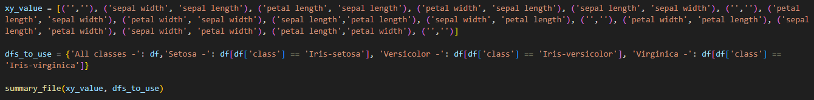
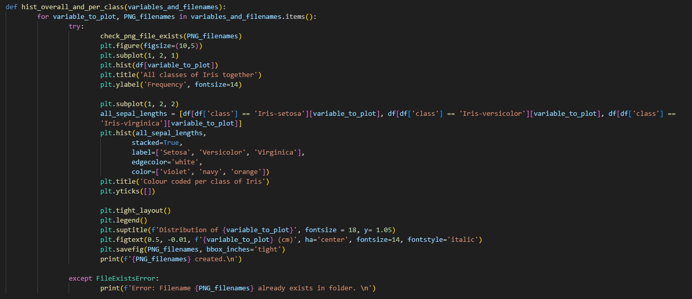
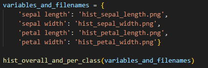
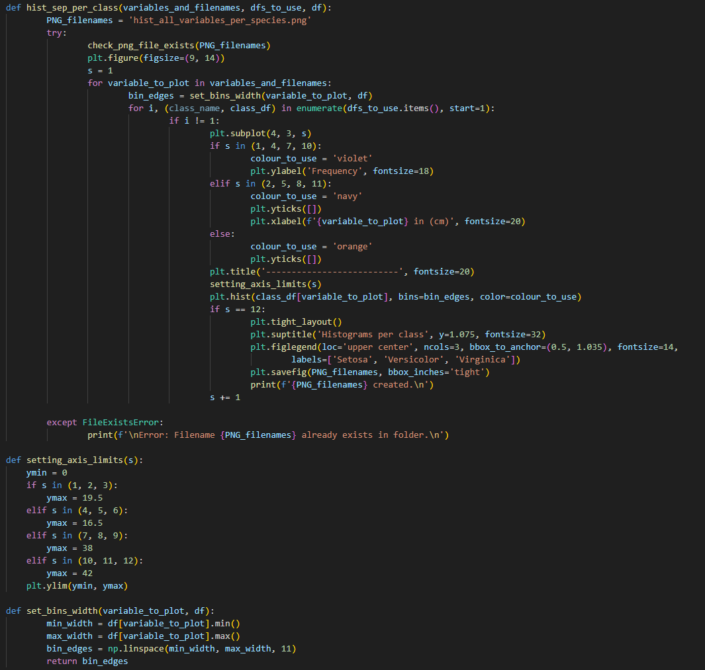
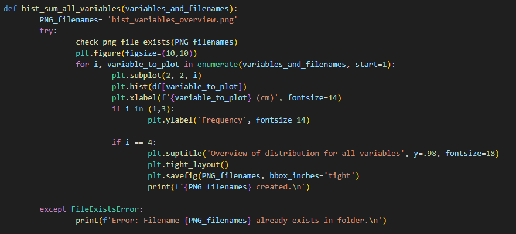
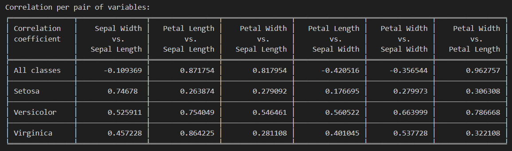
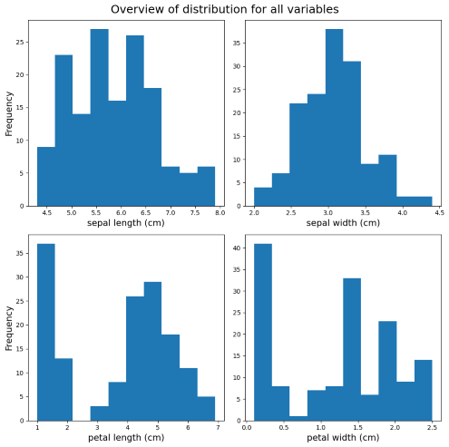
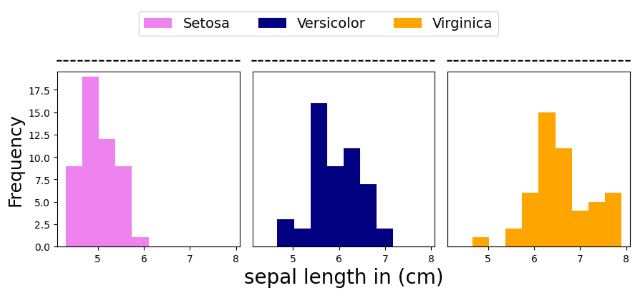

# IRIS dataset
## Introduction
“Visualization gives you answers to questions you didn’t know you had.”[^] – Ben Schneiderman 

In today’s world of data overload, it can be easy to get lost in the vast amount of information out there. Everyday more and more information is stored online, with endless potential for possibilities and insights to be derived from it but where do we start to understand such vast amounts of data? This is where data analytics and visualisation come into play.

In this project we will use the Iris dataset to showcase some of the possibilities held within Python for data analytics and visualisation when working with datasets.

We will dive into the data looking at statistical information generated for the different variables it contains. Attempting to gather meaningful insights using methods like correlation and standard deviation.

Scatter plots and histograms (generated by analysis.py) will accompany this analysis to present the data in a comprehensive way and aid in the identification of patterns. 

Using both the analysis and visualization tools we will evaluate the relationship between the variables and assess if considering additional factors such as class will impact the results and our interpretation of the data. 

## Summary of IRIS dataset
The IRIS dataset is a popular dataset commonly used for exploring data analysis and data visualisation. Used first by R.A. Fisher in 1936 to showcase a "then new technique of linear discriminant analysis" [^].  

The suitability of the Iris dataset has been questioned in part due to the unrealistic standards in the dataset. The dataset does not have any missing entries and contains uniform sample sizes, making it "cleaner than most real-world data that learners are likely to encounter". The dataset also lacks metadata which limits meaningful analysis and has only one sole variable for categorisation (class).  
In addition, due to the dataset's connection to R.A. Fisher there are ties to the ethically controversial field of eugenics. However, even critics of the dataset acknowledge that it "remains ubiquitous in statistics" and data analysis over 86 years after its first use [^], with the dataset often referred to as the "hello world" of the Data Science and Machine Learning fields. 

The dataset consists of measurements for 3 different classes (setosa, versicolor and virginica) of Iris flowers. 
There are 50 entries per species detailed in the dataset.

|Setosa    |Versicolor | Virginica|
|-----------|---------------|------------|
||||

In addition to the categorical variable of the class of Iris, the dataset also records entries for the characteristics of the petal and sepal of the flower, tracking the petal length, petal width, sepal length and sepal width. These four variables are numeric decimal place values. 
With this, the data type used for these variables will be float.

While the petal width and length may be a commonly understood variable, the sepal characteristics may be less intuitive for users, the below image labels petal and sepal to help understand the data being discussed.

## Cloning repository from GitHub
1. Copy the following URL:  
        https://github.com/Ange-Dvs/pands-project.git

1. Open CMDER or if using VS Code open the terminal pane

1. Go to the folder where you want to clone the repository to on your machine and type git pull  
        `git clone` https://github.com/Ange-Dvs/pands-project.git

1. Set merge as the mode for the pull  
        `git config pull.rebase false`

1. Initiate the pull of the GitHub repository  
        `git pull`

1. If the pull has been successful, you should see 4 files and 1 folder pulled from GitHub.
        The folder containing images used in the readme.md, the .gitignore file, a csv file containing the dataset, the readme.md and the analysis.py file which contains the program to run.  
        

## How to run *analysis.py*
1. To run the code open the terminal in VS Code (CMDER is also possible to use if preferred)
1. Navigate to the folder where the repository is stored
1. Type `python .\analysis.py` and hit enter
1. The python code should run and generate 8 files
    - modified_iris_data.csv
    - hist_sepal_length.png
    - hist_sepal_width.png
    - hist_petal_length.png
    - hist_petal_width.png
    - scatter_all_variables.png
    - hist_all_variables_per_species.png 
    - hist_variables_overview.png
1. If the code has run successfully, you will see confirmation printed when each file is created  
        

### Error handling within *analysis.py*
Error handling is including in the code to ensure if a file is already existing in the folder with the same filename the user will be informed.

The error messages will look like this:  

If the error message for a file is returned that file will not be re-created or overwritten.
If you want to rerun the code and create the files again, you'll need to delete the existing file or files first.    

## Walkthrough of *analysis.py* code
The next section is a walkthrough of the contents of the analysis.py file.  
While the functionality will be explained here, a line-by-line explanation of the code is contained within the analysis.py file itself.

The code contains the creation of:
- A modified `.csv` file with shortened names for variables
- A summary `.txt` file including some calculations using the data within the dataset
- Multiple `.png` files containing histograms of the variables showing the distribution of the dataset overall and colour coded per species, a larger figure containing a subplot showing the variables per species separately and a final figure showing the histograms of the 4 variables for the entire dataset
- A `.png` file show a scatter plot of each pair of variables

To have a concise view of code for the generation of the different files the order you will see the code here differs to that in analysis.py. 

### Importing required libraries

> ℹ️ *For more details on the libraries and information of the functions used within each libraries check the "[Libraries within python](https://github.com/Ange-Dvs/pands-project/blob/main/README.md#libraries-within-python)" section*

### Reading in the data

Before any analysis can be done the data from the dataset must be fetched. 

After the dataset is assigned to `original_df`, a clean is done to remove some characters from the column headers.  This is done to ensure that the data shown for the dataset using `describe()` in the text file is keep in the same row. As previously it was being separated due to the length of the column headers. 

The file with the modified headers is then saved to be used.

### Error handling for .png files

The first function which will be explained is reused throughout the code called the `check_png_file_exists()` function.  
This function enables an error message to be returned to the user if a filename for one of the generated plots is already existing.

The above function reads in the value passed for the `PNG_filename` variable allowing the functionality to be reused throughout the program for the creation of multiple `.png` files.  

The `os` library is used to check if the path exists for the file and raises a `FileExistsError` in case the filename is present in the folder, which in turn triggers the `except` path outside of the function.  

### Creating the summary .txt file

Next, we'll take a look at the function for the creation of the summary file `summary_file()`.

<b>Definition of variables and main text created for the text file</b> 

In the above, the `text_file_name` is first defined to be used for the error handling to ensure the file is not already existing when the program attempts to create it.  

Then the function attempts to follow the `try` path, here the file is created. Setting 'x' as the mode ensures that a `FileExistsError` is thrown if the file exists and will not amend or overwrite the file if it is already in the folder. If this happens the program will jump to the `except` path and print a message for the user informing the file already exists.  

Within the step of creating the file the encoding is also set, UTF-8 is used to allow for special symbols used in the table generated for the summary file to be saved to the text file.  

The next lines include the definition of numerous variables to use in the intro file. This intro, which includes the main bulk of text and mathematical summaries of the variables, is then written to the text file. Next the program moves to code calculating the correlation coefficient and displaying it in the text file for the user as a table.  

<b>Calculation of the correlation coefficient</b> 

An empty dictionary is created to later store the calculated correlation of the pairs of variables. A dictionary called `dfs_to_use` and a list called `xy_values` are passed from outside the function for use in the calculation. These are used to create a loop to allow the correlation for the relevant pairs of variables to be generated dynamically using values passed from the list and dictionary, removing the need for repeated lines of code with the variables hardcoded.  

The parent `for` loop passes over the different classes contained in the `dfs_to_use`, this allows the calculation of the correlation overall using the data in the entire dataset for all classes and then calculate it for the individual classes. Within the classes `for` loop another `for` loop is used to iterate through the `xy_value` list. `Enumerate` is then used to take the values from the tuples contained in the list and parse them to the variables `x_value` and `y_value`, it also starts the value the counter of the loop `i` to 1. 

Next an `if` statement is set to ensure that the calculation is only carried out for certain iterations of the loop. This is to avoid carrying out the same calculations more than necessary as the list is used also for the generation of the scatter chart and contains empty tuples and the same variables twice with the order swapped (i.e. ('sepal width', 'sepal length') and ('sepal length', 'sepal width')).  

When the `if` statement condition is met it is executed, the correlation is calculated using the class defined in the parent `for` loop and the x and y value defined in the second `for` loop. The name is then created using these values to allow for indexing into the dictionary when creating the table. The name and calculated correlation are then saved as a keypair to the correlations dictionary.

<b>Creation of the correlation coefficient table</b> 

After all calculations are completed, a list is created called `corr_table` which contains 5 sub-lists, you can think of each list as representing a row in a table.   

The string values within the first list will be used to set the headers. The second list contains the values for the calculated coefficient for the entire dataset. The third list calls the data for relevant correlation values for the Setosa only, followed by the Versicolour list fourth and lastly the values for the Virginica class in the fifth list. The name of the keypair is used to index into the `correlations` dictionary and retrieve the value for the corresponding correlation.  

The tabulate library is then used to take the `corr_table` list and format it as a table, it is set to consider the first row to be headers and the fancy grid option for the formatting is used. The table is then written to the summary file and the code for writing the summary file within the function is finished.

**Main Program Code Snippet**

To make the code easily readable, the amount of code outside of the functions is kept to a minimum, for the creation of the summary file the relevant components in the main code block can be seen above. 
1. The `xy_value` list - used to set the variables which should be used for calculating the correlation coefficient
1. The `dfs_to_use` dictionary - used for selecting which data to use in the correlation calculations, using first the data for the entire dataset and then separating the entries depending on class.
1. Line triggering `summary_file()` - this calls the function to be initiated and passes the list and dictionary to the function to be used within the function. 

### Creating the scatter plot

The function uses the tuples from the `xy_value` list to generate a figure containing 16 subplots.

The `try` path is first attempted, using `check_png_file_exists()` function again, if it returns a `FileExistsError` the `except` path will be triggered. The filename is defined and size of the figure for the `.png` file is set to allow for the image to be large enough to comfortably fit the data in the image while avoiding potential overlap to ensure the plots are readable and not too small considering a large number of subplots are required to fit in the final figure.  

<b>Looping over the values to be used for x and y</b> 

A `for` loop is also used in this function to iterate over the tuples in the list to reduce excess lines of code. The `for` loop sets the corresponding information in the tuple as the x and y value to be used in the plots, a counter is created as `i` with a starting value of 1 to allow the counter to be used to dynamically set the position of the subplot for each iteration later. 

<b>Creating empty plots & condition for saving the figure</b> 

An `if` statement checks if the iteration is matching one of the numbers in the first condition, if it does the corresponding plots will not contain a scatter plot but instead an empty plot is generated. `figtext` is then used to position the name of a variable within the boundaries of the empty plot, this is to reflect which variable is being used for the x-axis in a column and the y-axis in the row.  

It also contains the logic to identify if the loop is in the last iteration to ensure the file is saved and the relevant steps which are only required to be completed once at the end are triggered. This includes the creation and positioning of the legend, the creation of the title for the figure and ensuring the layout of the plots are not overlapping. A message is also printed for the user at this stage in the loop to confirm the creation of the scatter plot `.png` file. 

<b>Creating subplots containing the scatter plot of each pair of variables</b> 

The main `else` block contains the path all other iterations should take which involves creating scatterplots using the values contained in the tuples in the `xy_value` list. This block also includes a check for which class is being plotted and setting the corresponding colour depending on the class. 

An `if` statement is also used to ensure that the data for the dataset as a whole is not plotted, the overall unfiltered dataset is not used in this case as the goal is to show the scatter plot with colours indicating which class is linked to each marker on the plot. If any of the individual classes are used for an iteration it triggers the line of code responsible the creation of the scatter plot, the line is dynamic using the value for the `class_df` from the `dfs_to_use` diction and the x and y values are select using the tuples in the `xy_value` list for each iteration. 

<b>Customization of x and y ticks for specific subplots</b>  

As the requirements for customization of the plots varies depending on which position the subplot is placed, a series of `if` `elif` statements are used to enhance the settings for the subplots depending on the iteration/subplot using the value of `i`. The majority of the subplots require the removal of the x and y ticks, this is handled by the first `if` statement. 

The next 5 `elif` statements contain the ability to remove the x or y ticks or move the x or y ticks depending on what is required for the plot. For example, for the subplot in position 4, the x and y ticks are set to be placed on the opposite side of the plot. Instead of the x labels and ticks being on the bottom of the plot as per the default, they are set to be moved to the top of the plot.   
Similarly for the y-axis the y labels and ticks are set to be placed on the right of the plot instead of the left. This is done to reflect that the same range is used for all of the values in that column and y values in the row, in the end aiming to reduce clutter in the image and make the plot easier to read for the user. 

**Main Program Code Snippet**

For the creation of the scatter plot file the relevant components in the main code block can be seen above. 
1. The `xy_value` list - used to set the variables for the x and y axis of each subplot depending on the iteration of the parent `for` loop within the function
1. The `dfs_to_use` dictionary - used for selecting which data to use in creation of the scatter plots, these values are also used for selecting the colour to be used in the loop `for` each class.
1. Line triggering the `scatter_all_variables()` - this calls the function to be initiated and passes the list and dictionary to be used within the function.

### Creating Histograms

The *analysis.py* code generates a number of histograms saved as `.png` file. The next section will walk through how this is done per type of image. 

#### i. Creating histograms showing overall and class specific distribution per variable

The next section will handle the creation of figures containing 2 subplots, showing the distribution of each variable for the entire dataset and then factoring in the class of Iris.

The function uses the keypair values from the `variable_and_filenames` dictionary.  

A `for` loop is used to iterate over the keypairs in the dictionary reducing unnecessary repetition code. The `try` path is first attempted, if the `check_png_file_exists()` function returns a `FileExistsError`, the `except` path will be triggered. The size of the figure for the `.png` file is set to allow for the image to be large enough to comfortably fit the data in the figure.

Next the creation of two subplots is triggered, first a plot showing the data for the variable in a given loop within the entire dataset, this is then plotted to the subplot in the first position. 

Next the histogram is created again for the subplot in the second position. However, this time the data is colour coded per class of Iris to visualise the spread of data depending on the class. This is done using the `stacked` attribute to allow the data to be stacked on top of each other instead of treated as separate columns. 

<b>Customizing the histograms</b> 

Along with the figure size being set, there are various settings defined for customizing the appearance of the histogram.
The colour to be used for plotting the data per class is defined, the yticks are removed from the second subplot to avoid overcrowding of the figure as it is using the same range as the first subplot.  An overall title detailing the variable which is being plotted is added and the font size and position set. A shared label for the x-axis is created using `figtext` since the plots share the same variable, the style, size and position of the text is defined. 

Lastly, the file is saved using the filename passed in from the dictionary, it is ensured that no data like the title is cut off when saving using the `bbox_inches` attribute. A message is then printed to the user providing the filename and informing that the file has been created.

**Main Program Code Snippet**

For the creation of the histogram file the relevant components in the main code block can be seen above. 
1. The `variables_and_filenames` dictionary - used for passing the variable to plot in a loop to the function and the related filename to use when saving the figures.
1. Line triggering the `hist_overall_and_per_class()` function - this calls the function to be initiated and passes the dictionary to be used within the function. 

#### ii. Creating histograms of each variable per class

Like the other plots, a check is done to ensure the file is not already existing using !`check_png_file_exists()` and the user is informed.  
If the file is not existing already, the program continues in the `try` path.  

The size for the overall figure is first set outside of the loop as we want all subplots within the same `.png` file.  
A counter `s` is defined, this will be used to dynamically set the value for the subplot position in the figure.  

Next a `for` loop is defined with the purpose of cycling through the variable and filename dictionary and pulling the variables listed. 

<b>Setting the bin width</b>  
In order to have the width of the bins in the histograms consistent for each of the individual histogram per variable, a function gets the minimum value in the dataset for a variable and sets that as the min number in the range.  
The same approach is carried out to find the max for the range, these two numbers are then used to generate an array of evenly spaced numbers using `NumPy`'s `linspace` function.  
This is then used to set the bin width for all histograms for that variable, when the loop changes to the next variable, the min and max value will be recalculated to get the appropriate range again for the column's width for the next iteration of the function.

<b>Customization of the histograms</b>  
After the `set_bins_width()` function completes, it returns the values to be used.

The next steps involve a `for` loop taking the values from the `dfs_to_use` list and setting them to the variables `class_name` and `class_df`.  
The `class_df` is then used to determine which class of data is represented in the plot.  
The first item in the `dfs_to_use` list contains the entire unfiltered dataset, which we do not want to plot.   
An `if` statement checks to ensure the plotting is only carried out for the other items in the list. 

Depending on which subplot is being generated, the colour for the bins is set, the removal of the y ticks or repositioning of the ticks to the right-hand side of the plot in the last column of each row. A label is also added in these loops to show which variable is being plotted in the row.  
The title field is used to create a line break in between the rows to emphasize the separation of the variables per row.

<b>Setting y-axis range</b>  
Next the y-axis limits are set per row of subplots, a function sets the limits for the y range depending on the variable. i.e. all subplot in row 1 have the same y range defined so you can see the height of the columns and compare to the other subplots for the same variable.

In this function the min for y-axis is set to 0 for all plots in the figure. An `if` statement branches out to decide what the max should be for the axis depending on the subplot being created using the value for the iteration counter.
The y-axis range is then set for the respective variable.  

<b>Plotting the histograms</b>  
After the y range is set the histogram has all needed information for the subplot to be created.  
The data to be used is pulled from the `class_df` for the iteration, the variable to plot is passed in from the first `for` loop, the bins are set using the returned value from the `set_bins_width()` function and the colour is chosen depending on the subplot in question. 

At the end of the `if` statement, the value for `s` is updated to allow it to be used as the value for the next subplot.  
This loop continues until the 12 subplot is generated, at this point the title is added using the font size chosen and the position set for the y-axis. 
The legend is generated and font size chosen. Using the `loc` and `bbox_to_anchor` attributes the position for the legend in this figure is set, being displayed at the very top of the figure just under the title since the key is applicable for all subplots in the figure. The legend is also customized to have 3 columns, with the key of one class shown in each column.

The file is then saved and the user is informed the file has been created.

<b>Main Program Code Snippet</b> 

For the creation of the histogram file the relevant components in the main code block can be seen above. 
1. The `dfs_to_use` dictionary - used for selecting which data to use in creation of the scatter plots, these values are also used for selecting the colour to be used in the loop for each class.
1. The `variables_and_filenames` dictionary - used for passing the variable to plot when creating the subplots.
1. Line triggering the `hist_sep_per_class()` - this calls the function to be initiated and passes the list and dictionary to be used within the function.

#### iii. Creating histograms for each variable for the entire dataset

Like the other plots, a check is done to ensure the file is not already existing !`check_png_file_exists()` and informs the user if this is the case.  
If the file is not existing already, the program continues the `try` path.  

The size of the final figure is then set. A `for` loop is initiated with a counter `i` starting at 1. This counter is important as it will be used to dynamically set the subplot location depending on the iteration. The variable to plot is taken from the `variable_and_filenames` dictionary. This dictionary is also used as the bases for the `for` loop ensuring that each variable will be plotted. 
Al label is added to the x-axis of each subplot to identify which variable is being shown in a specific plot. 

On the fourth iteration, the loop completes additional one-time steps like adding a title to the plot and setting the location and font size for the title. `Matplotlib.pyplot`'s `tight_layout` is used to adjust the space between the plots as needed. The file is then saved and a message returned to the user informing the file has been created and specifying the filename.

**Main Program Code Snippet**

For the creation of the histogram file the relevant components in the main code block can be seen above. 
1. The `variables_and_filenames` dictionary - used for passing the variable to plot when creating the subplots.
1. Line triggering the `hist_sum_all_variables()` - this calls the function to be initiated and passes the list and dictionary to be used within the function.

## Analysis of findings from analysis.py

Now that the steps taken in *analysis.py* to create the different files have been explained, let us look what can be understood from information provided in the generated text file and figures. 

### Correlation between variables 

<b>Overall dataset:</b>  
When looking at the calculated correlation between the variables in the dataset as a whole we can see that some pairs of variables appear to be strongly linked. 

**Variables showing strong positive correlation**
- Petal Length vs Sepal Length: 0.871754    
- Petal Width vs Sepal Length: 0.817954   
- Petal Width vs Petal Length: 0.962757  

The results of the correlation coefficient for the 3 pairs of variables listed above indicate a strong positive relationship, when one variable in a pair increases the other is likely to increase as well.  
The Petal Width vs Petal Length pairing appears to be a near perfect linear positive correlation of 0.962757.

**Variables showing a moderate negative correlation**
- Petal Length vs Sepal Width: -0.420516   

For the pair above there is a moderate negative correlation, the correlation is not as strong as the pairings listed above.  
We also see that the direction of the relationship is negative, which indicate that when one variable increases the other is likely to decrease.  
While the correlation is still a significant enough amount to indicate some relationship between the pairings, it is not very reliable. 

**Variable showing a weak or very weak negative correlation**
- Petal Width vs Sepal Width: -0.356544  
- Sepal Width vs Sepal Length: -0.0109369  

When looking at the sepal width vs sepal length we can see these are the weakest of the correlations when look at the dataset as a whole.  
The result is indicating an extremely week negative relationship, meaning it could not be assumed that as one variable increases the other would decrease in a proportionate way.  

Next, we'll factor in the class of Iris to see if the correlation between the variables differs depending on the class.

<b>Breakdown per species:</b> 

*Setosa*

**Variables showing strong positive correlation**
- Sepal Width vs Sepal Length: 0.74678 

**Variable showing a weak or very weak negative correlation**
- Petal Width vs Petal Length: 0.306308
- Petal Width vs Sepal Width: 0.279973
- Petal Width vs Sepal Length: 0.279092
- Petal Length vs Sepal Length: 0.263874
- Petal Length vs Sepal Width: 0.176695

*Versicolor*

**Variables showing strong positive correlation**
- Petal Width vs Petal Length: 0.786668  
- Petal Length vs Sepal Length: 0.754049  

**Variables showing a moderate positive correlation**
- Petal Width vs Sepal Width: 0.663999
- Petal Length vs Sepal Width: 0.560522
- Petal Width vs Sepal Length: 0.546461
- Sepal Width vs Sepal Length: 0.525911

*Virginica*

**Variables showing strong positive correlation**
- Petal Length vs Sepal Length: 0.864225  

**Variables showing a moderate positive correlation**
- Petal Width vs Sepal Width: 0.537728  
- Sepal Width vs Sepal Length: 0.457228
- Petal Length vs Sepal Width: 0.401045  

**Variable showing a weak or very weak positive correlation**
- Petal Width vs Petal Length: 0.322108  
- Petal Width vs Sepal Length: 0.281108  

**Observations from correlation table**

From the above breakdown we can see that there is in fact a difference in correlation for a pair of variables depending on the class of Iris, with an interesting variety in the results for the pairings across the dataset as a whole versus the individual classes.

For example, when we look at the Petal Width vs Petal Length, overall we see a near perfect positive correlation of 0.962757.  
However, when we look across the classes, we see Setosa (0.306308) and Virginica (0.322108) have a much weaker correlation compared to when looking at the values for all classes as one.  

Likewise with Petal Length vs Sepal Width, overall we see that there is a moderate negative correlation across the dataset (-0.420516). 
In contrast, when we look at the individual classes, none of the classes suggest a negative relationship between the petal length vs sepal width when the data for a class is isolated. In fact, when looking at Virginica and Versicolor as individual groups of data, we can see that they have a moderate positive correlation between the variables. 

Another example which highlights the difference once taking the class into consideration, is the Sepal Width and Sepal Length. Looking at the calculation for the overall dataset you would assume that there is very weak negative correlation between the pair of variables throughout the dataset. However, when we look at the individual classes, we see that actually all relationships indicate a moderate to strong positive relationship between the variables.

We can also see that each class of Iris has its own pattern and relationship between the variables, indicating that the class of species has a big effect on the petal and sepal sizes. 

These differences highlight the importance of understanding the complexity of the data being analysed in the dataset and the importance of considering underlying factors when interpreting the results.  
If the understanding of the correlation of the variables was based solely on the calculated correlation of the overall dataset combined, it would be very easy to reach incorrect conclusions.

### Scatter plot analysis

Looking at the scatter plot above we can make some interesting observation. 

Setosa's appear to be more of an outlier and the easiest of the classes to distinguish using the characteristics of the sepal and petal, with Versicolor and Virginica being more closely grouped across all plots.

Due to the heavy overlap of the Versicolor and Virginica markers on the sepal length vs sepal width plot, we can determine that this pairing would not be recommended for the use of trying to distinguish between the different classes. The wide spread of data for the variables also shows us that there is a lot of variety in the ranges in this pairing.  

In contrast we see the class markers overlapping a lot less for the petal length vs petal width plot and so this pairing may be a better candidate to use as clusters are more defined per the individual classes.

From the plots we can also see that of the classes, the Virginica class tends to have the widest and longest petals, with Setosa being much smaller in this respect.  

The scatter plot illustrates the variety in shape and size of the characteristics per class while also being a useful tool for potentially helping classify the data or make predictions about the class of an Iris depending on the measurements. For example, in this case, it would be most easily used to determine if an Iris was Setosa or not due to their more distinct sizes compared to the Versicolor and Virginica classes.

The scatter plot also helps to visualise the correlation previously discussed for each of the variables. 
By seeing the plots of the pairings colour coding per class we can match the calculated correlation to the patterns in the plot, helping to show how the values of the variables per class impacts the correlation.

### Histogram analysis

Moving next to the histograms we'll start by looking at a high-level summary showing a histogram per variable for the dataset as a whole.

Looking at the variables plotted in each of the subplots, the data seems quite spread out with the majority of histograms containing more than one peak.  

For petal width and sepal length the histogram appears to be multimodal with more than 2 peaks.  
For petal length the histogram appears to be bimodal with two distinct peaks.  
Then for sepal width this histogram appears to be unimodal.  

Next, we'll take a look at the histograms factoring in the class of Iris, to see if this provides any further insight for the distribution of the variables.

From a quick look at the above, we can see that the classes overlap for some variables more than others. With some appearing to show more similarities in size while others having distinct clusters depending on the class. 

Keeping this in mind, we'll take a look further into the different variables separately.

<b>Petal length</b> 

  

When looking at the Petal length for the entire dataset as one, there appears to be moderate variety in the data, with one peak completely separated from the remaining cluster. 

From the summary file we identified that the standard deviation for the petal length is 1.76cm. Knowing the range is 1cm (min) to 6.9cm (max) we can interpret that that there is a moderate spread from the mean. From the text file we can also see that the mean is 3.76cm and looking at the plot above we see that this is one of the smaller bins in the histogram and that the distribution is not uniform with a clear gap between two clusters in the histogram.

Adding in the class a new perspective is shown across the dataset.  
For the Setosa we can see these flowers are separated from the rest with a strong grouping between 1 - 1.5 (cm). 

For the Versicolor and Virginica we see an overlap with these two classes having more similarities when it comes to their petal length.

This shows us that the Setosa class are more easily distinguished from the remaining classes when it comes to petal length. We also see that the Virginica class are likely to be the longest of the petals while the Versicolor will fall somewhere in between the two.

Looking at the data isolated per graph we can see the distribution for the Versicolor and Virginica more clearly.  
For Versicolor we can see the histogram is a unimodal structure, while not as severe as the Setosa, it has one peak. With Virginica class, we do not have as drastic of a difference between the bins. 

<b>Petal width</b> 

Coming to the next variable, we'll now move on to the petal width.

Looking at the dataset as a whole, we see the histogram is multimodal with multiple peaks in the plot suggesting that there is a lot of variability in petal widths across the dataset.

Interestingly, when we add the 3rd factor of class into the plot, we can see that the three peaks represent the main clusters for the individual classes. 

Similarly to the petal length, we see that the Setosa data is clustered to the smaller end of the x-axis between (0.1cm to 0.6cm), with this clear separation of the petal width and length these characteristics could be a good candidate if trying to use the data to identify if an Iris is of the Setosa class.

With the Versicolor and Virginica classes, we again see slight overlap in the ranges. The histogram for the Versicolor class is unimodal with a clear peak in the distribution and lies again between the Setosa and Virginica classes in terms of size.  
The Virginica class appears to have a less distinct peak and has more of a spread with the largest standard deviation of the group (0.27cm) and the largest petals in both length and width.

<b>Sepal length</b> 

We'll next change from reviewing the petal characteristics to focus on the sepal length.

Again, we see a multimodal histogram with the majority of the data clustered to the centre and left of the plot.  

In contrast to the histograms for petal length and width, we can see in the sepal length plot that there is much more of an overlap between the 3 species.  

When looking at the classes isolated with their own plots, we can see that again the Setosa class falls towards the smaller end of the plot with a single peak. When also taking what we have learnt from the petal width and length into consideration, the data shows that the Setosa flowers tends to be clustered closely together in size, seeming to typically be smaller for these characteristics compared to the other classes. 

While there are many intrinsic factors which could contribute to this similarity between the Versicolor and Virginica class, it has been noted that botanist Edgar Anderson (who provided the data for R.A. Fisher to use) believed that the versicolor class could be the "result of hybridisation between the virginica and another class of Iris" [^]. This adds another perspective as to why we see the similarities between the two classes, also acting as reminder that while we can analyse the information contained within the dataset, there is nuance and further context that cannot be reflected.

The range for Versicolor, like for the petal width and length, appears to be in the middle of the Setosa and Virginica clusters. Virginica again seeming to contribute mostly to the right end of the plot with a larger sepal length. 

<b>Sepal Width</b> 

Lastly, we'll look to the sepal width.

  

This histogram appears to be the closest of the variables to match the typical normal distribution shape, with one main peak around the mean (3.05cm).

Like with the sepal width, there is much more overlap between the classes versus the histograms of the petal length and width. 

In contrast to the other variables, we see the Setosa cluster is located primarily on the right of the plot, making up the majority of the entries for the larger values recorded. 

Versicolor in comparison is making up the left tail of the distribution, like the Setosa class the Virginica data also appears to be unimodal with one peak. 

From looking at the sepal variables (width and length) we see for both that the ranges for the sepal characteristics tend to overlap more than that of the petal characteristics. The would indicate that the sepal characteristics are a less suitable option for identifying the class. 

This finding is in line with the typical suggestion from those who have previously analysed the famous dataset with academics such as Maurice Maeck stating the petal "parameters are much more discriminatory than the sepal parameters" in his 2018 paper *Fisher's iris classification revisited*[^].

## Conclusion
From the analysis of the Iris dataset, we have been able to gain insight into the characteristics of the different Iris classes. Seeing how each class has its own patterns across the variables and how some variables may be more suited than others to be used for classification of Irises.

The above exploration shows how the use of data analysis and visualisation, like the libraries used here from Python, are vital for bringing the data to life.  

Deriving statistical information from the dataset, such as correlation and standard deviation, provides a bases for analysing the data and creating meaningful insights from the large amount of information stored in a dataset.  

Functionality such as histograms and scatter plots aid in showcasing the information in a more comprehensive manner, enabling distinct patterns to be identified within the variables. Allowing the user to more deeply understand the data contained in the Iris dataset and make informed interpretations of the data. 

From the use of these tools, it was possible to interpret the data to gain an understanding of the variables independently, while also having the possibility to see and evaluate the relationship between variables. Demonstrating how adding additional factors, like the class of Iris, to the equations can directly impact the results of statistical calculations like correlation and standard deviation while also impacting our interpretation of the data as a whole. Once again highlight the importance of understanding the data being analysed, knowing it’s limits, and diving deeper to assess if further meaningful patterns can be identified when an additional factor is added. 

## Additional resources/reading
### Libraries within python

Within the program we are importing various external libraries and classes to use throughout the notebook including: 
- `Pandas`
- `Matplotlib.pyplot`
- `NumPy`
- `Tabulate`
- `os`

<b>Pandas</b> 
`Pandas`[^] is a library in Python used for data analysis which enables the use of two-dimensional tables called DataFrames.  
Within the *analysis.py* file the `Pandas` library is used to read in the data from the Iris dataset.  
The following are some methods used throughout the project from `Pandas`: 
> `.corr` - used for calculating the correlation coefficient for the pairs of vairables in the dataset.[^]

> `.unstack` - used with the groups created with `groupby()` to arrange them in an organised manner. This allows us to create a stacked bar chart to visualise the data of the species per island.[^] 

<b>Matplotlib.pyplot</b> 
The `Matplotlib.pyplot` library is used mainly for visual representation of the dataset.
This library enables the creation of many types of plots including bar charts, histograms and scatter plot which are generated by the *analysis.py* file.  
There is a high-level of customisation possible with options to switch up the colour,[^] markers,[^] labels and titles of the plots.

The following are some methods used throughout the notebook from `Matplotlib.pyplot`: 

> `.scatter` - creates scatter plots to visualise the relationship between two variables by plotting markers on a graph where each marker represents an entry in the dataset.[^]

> `.plot` - used in the *analysis.py* to create empty plots as placeholders for text containing the variable names to be used for the scatter figure.

> `.hist` - creates histogram to represent distribution of values for a variable in the dataset.[^]

> `.subplot` - supports the creation of multiple plots in one figure. The number of plots which can be displayed is controlled by values entered for the number of columns and rows required. 

> `.xticks` & `.yticks` - offers the ability to change the default tick settings on the x and y axes including the possibility to change the position of the ticks on the plot borders or remove the ticks completely.[^]

> `.xlabel` & `.ylabel` - sets the heading for the axes and allows customisation of the font with the possibility to change the style, font and location of the labels. [^] 

> `.ylim` - used for setting the limit of the y-axis. This is useful when it's needed to overwrite the default value or range for the axes. [^]

> `.figtext` - used for adding text to plots. In *analysis.py* it is used to set super-labels to axes which have a common variable to make the figure less cluttered and easier to read. [^]

> `.figure` - is used in *analysis.py* to adjust the size of the figure, to ensure that figures with multiple plots are not overcrowded or distorted and difficult to read. [^]

<b>NumPy</b> 
`NumPy` is used in the *analysis.py* file to facilitate calculations on the large amount of data. When working with datasets `NumPy` is useful for its ability to handle arrays and possibility to complete mathematical calculation and sorting.[^]

> `.linspace` - used to generate a `NumPy` array of evenly spaced numbers between a min and max value, the amount of numbers to be included is customizable.[^]

<b>Tabulate</b> 
`Tabulate` makes it possible to create formatted tables to present data from DataFrames and lists in a clear and concise way.  
The table's appearance is customisable, with options to configure if the table has headers and if there are borders between the cells. [^]

<b>os</b> 
The `os` library enables the ability to complete actions which require use of the operating system. 

> `os.path.exists` - within the *analysis.py* program we see this functionality used for the error handling steps. Allowing the program to check first if a file is already existing before creating or overwriting the file. This can be used to raise and error if the file is present to avoid files being corrupted or incorrectly overwritten.[^]

<b>Python core functionality</b> 

In addition to the above functionality from the imported libraries, there is two honourable mentions for functionality within the standard Python environment which are key for the *analysis.py* file. 

> `enumerate` - Works as a way to loop over objects while also keeping count for the loop. Makes it possible to work with dictionaries key-pairs when used with the items() method. The function takes in two arguments, the sequence to be used for the loop and optionally the starting value for the loop. Using indexing enumerate adds the possibility to access key-pair information from a dictionary, this makes it possible to change values in the loop after each iteration.   
In the case of *analysis.py* file it allows for the variable to be used to plot the histogram and the filename of the `.png` to be updated after each iteration resulting in much neater code.  It is also used for the creation of the scatter plot to enable loops to be used to avoid unnecessary repetition of code by iterating over the different combinations of variables to compare and plot. [^]

> `.items` - Returns a view option that contains key-pair values in from a dictionary.   
For *analysis.py* it is pulling the variable and `.png` filename to be used with the enumerate function for the histogram loop.  It is also used to pull the information of the class name and respective filtered information from the dataset for the scatter plot and the large histogram of all variables separated per species.

### Paper references: 

[^] Maeck, M. (2018) ‘La classification des iris de Fisher revisitée’, Naturalistes Belges, 99(3), pp. 7. Available at: https://search.ebscohost.com/login.aspx?direct=true&AuthType=ip,sso&db=asn&AN=137579970&site=eds-live&scope=site

[^] Unwin, A. and Kleinman, K. (2021) ‘The iris data set: In search of the source of virginica’, Significance, 18(6), pp. 1-2. doi:10.1111/1740-9713.01589.

[^] Horst, A.M., Hill, A.P. and Gorman, K.B. (2022) ‘Palmer Archipelago Penguins Data in the palmerpenguins R Package - An Alternative to Anderson’s Irises’, R Journal, 14(1), pp. 244–254. doi:10.32614/rj-2022-020.

[^] Quoted in Andy Kirk (2012) Data Visualization: a Successful Design Process : Data Visualization: a Successful Design Process. Birmingham, UK: Packt Publishing (Community Experience Distilled). Available at: https://search.ebscohost.com/login.aspx?direct=true&AuthType=ip,sso&db=e000xww&AN=526173&site=eds-live&scope=site 

### Links:

https://en.wikipedia.org/wiki/Iris_flower_data_set  
https://www.markdownguide.org/hacks/  
https://www.kaggle.com/datasets/uciml/iris  
https://archive.ics.uci.edu/dataset/53/iris 

https://matplotlib.org/stable/api/_as_gen/matplotlib.pyplot.legend.html  
https://matplotlib.org/stable/gallery/statistics/histogram_multihist.html  

https://www.geeksforgeeks.org/create-a-stacked-bar-plot-in-matplotlib/  
https://www.pythoncharts.com/matplotlib/histograms/#:~:text=The%20histogram%20bars%20have%20no,some%20separation%20between%20the%20bar.&text=An%20alternative%20is%20just%20to%20make%20the%20bars%20skinnier%20using%20rwidth%20.  
https://matplotlib.org/stable/users/explain/colors/colors.html  
https://levelup.gitconnected.com/unveiling-the-mysteries-of-the-iris-dataset-a-comprehensive-analysis-and-machine-learning-f5c4f9dbcd6d  
   
https://matplotlib.org/3.1.1/api/_as_gen/matplotlib.pyplot.suptitle.html  
https://www.geeksforgeeks.org/matplotlib-pyplot-suptitle-function-in-python/  

https://www.simplilearn.com/tutorials/python-tutorial/enumerate-in-python
https://www.freecodecamp.org/news/how-to-check-if-a-file-exists-in-python/  
https://www.geeksforgeeks.org/python-check-if-a-file-or-directory-exists/

https://www.w3schools.com/python/ref_dictionary_items.asp
https://www.geeksforgeeks.org/python-dictionary-items-method/
https://docs.python.org/3/library/stdtypes.html#dictionary-view-objects

Inspiration for format of the scatter plot https://en.wikipedia.org/wiki/Iris_flower_data_set#/media/File:Iris_dataset_scatterplot.svg

[^]: https://numpy.org/devdocs/user/whatisnumpy.html

OS - https://docs.python.org/3/library/os.html

## Footnotes: 

[^1]: 
[^2]: 
[^3]: 
[^4]: 
[^5]: 
[^6]: 
[^7]: 
[^8]: 
[^9]: 
[^10]:
[^11]:
[^12]:
[^13]:
[^14]:
[^15]:
[^16]:
[^17]:
[^18]:
[^19]:
[^20]:
[^21]:
[^22]:
[^23]:
[^24]:

[^]: Quoted in Andy Kirk (2012) Data Visualization: a Successful Design Process : Data Visualization: a Successful Design Process. Birmingham, UK: Packt Publishing (Community Experience Distilled). Available at: https://search.ebscohost.com/login.aspx?direct=true&AuthType=ip,sso&db=e000xww&AN=526173&site=eds-live&scope=site
[^]: Horst, A.M., Hill, A.P. and Gorman, K.B. (2022) ‘Palmer Archipelago Penguins Data in the palmerpenguins R Package - An Alternative to Anderson’s Irises’, R Journal, 14(1), pp. 244–254. doi:10.32614/rj-2022-020.
[^]: Unwin, A. and Kleinman, K. (2021) ‘The iris data set: In search of the source of virginica’, Significance, 18(6), pp. 1-2. doi:10.1111/1740-9713.01589.
[^]: Maeck, M. (2018) ‘La classification des iris de Fisher revisitée’, Naturalistes Belges, 99(3), pp. 7. Available at: https://search.ebscohost.com/login.aspx?direct=true&AuthType=ip,sso&db=asn&AN=137579970&site=eds-live&scope=site

Libraries in python section

[^]: https://pandas.pydata.org/docs/user_guide/10min.html#min
[^]: https://www.geeksforgeeks.org/python-pandas-dataframe-corr/
[^]: https://medium.com/@anala007/how-to-reshape-your-dataframe-with-pandas-stack-and-unstack-functions-3e2c86edc04a
[^]: https://matplotlib.org/stable/users/explain/colors/colors.html 
[^]: https://matplotlib.org/2.0.2/api/markers_api.html  
[^]: https://www.w3schools.com/python/matplotlib_scatter.asp
[^]: https://www.geeksforgeeks.org/matplotlib-pyplot-hist-in-python/
[^]: https://matplotlib.org/stable/api/_as_gen/matplotlib.pyplot.xticks.html#matplotlib-pyplot-xticks
[^]: https://www.w3schools.com/python/matplotlib_labels.asp   
[^]: https://www.geeksforgeeks.org/how-to-set-the-x-and-the-y-limit-in-matplotlib-with-python/
[^]: https://www.geeksforgeeks.org/matplotlib-pyplot-figtext-in-python/
[^]: https://www.geeksforgeeks.org/matplotlib-pyplot-figure-in-python/
[^]: https://matplotlib.org/stable/api/_as_gen/matplotlib.patches.Ellipse.html#matplotlib-patches-ellipse
[^]: https://matplotlib.org/stable/gallery/statistics/confidence_ellipse.html#sphx-glr-gallery-statistics-confidence-ellipse-py
[^]: https://www.datacamp.com/tutorial/python-numpy-tutorial
[^]: https://www.analyticsvidhya.com/blog/2023/12/mastering-tabulate/
[^]: https://realpython.com/np-linspace-numpy/
[^]: https://www.geeksforgeeks.org/python-os-path-exists-method/
[^]: https://www.simplilearn.com/tutorials/python-tutorial/enumerate-in-python#what_does_enumerate_do_in_python

## End